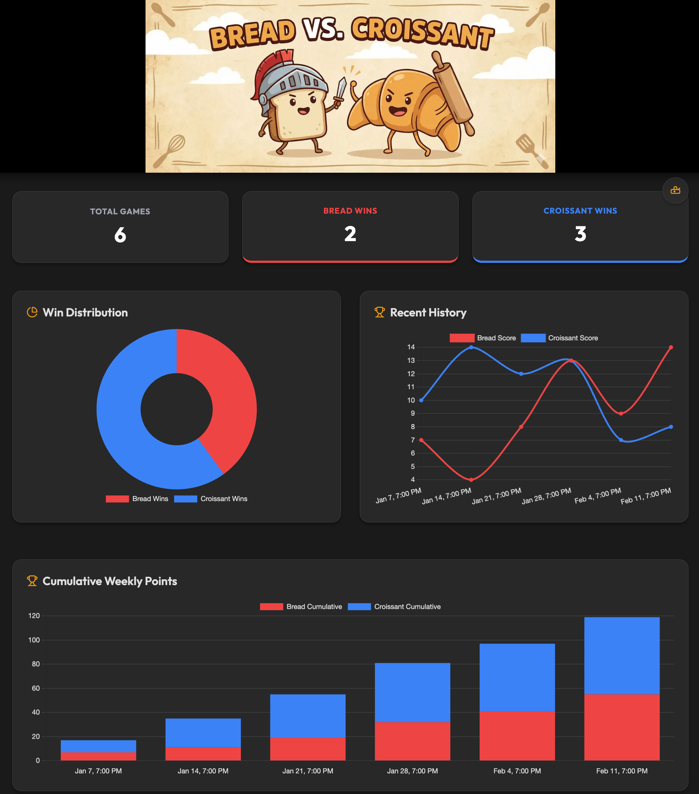

# Bread vs Croissant Game Tracker

A modern, real-time dashboard for tracking competitive matches. Features include dynamic score visualization, cumulative win tracking, and glassmorphic UI design. Built on Next.js with Google Cloud Storage and OAuth integration.



## Prerequisites

- Google Cloud Account
- Google Cloud SDK
- Copy .env_example to .env and fill in the values

## Setup
```bash
REGION=
PROJECT_ID=
PROJECT_NUMBER=
FQDN=
GCS_BUCKET_NAME= #e.g. gs://example-bucket
OAUTH_CLIENT_ID=
OAUTH_SECRET=
NEXTAUTH_SECRET=
NEXTAUTH_URL=

printf 'y' |  gcloud services enable artifactregistry.googleapis.com
printf 'y' |  gcloud services enable cloudbuild.googleapis.com
printf 'y' |  gcloud services enable run.googleapis.com

gcloud iam service-accounts create cloudrun-build-sa \
  --description="Custom Cloud Run Build Service Account" \
  --display-name="Custom Cloud Run Build Service Account" \
  --project ${PROJECT_ID}

gcloud projects add-iam-policy-binding ${PROJECT_ID} \
--member=serviceAccount:cloudrun-build-sa@$PROJECT_ID.iam.gserviceaccount.com \
--role=roles/cloudbuild.builds.builder

gcloud projects add-iam-policy-binding ${PROJECT_ID} \
--member=serviceAccount:cloudrun-build-sa@$PROJECT_ID.iam.gserviceaccount.com \
--role='roles/logging.logWriter'

gcloud projects add-iam-policy-binding ${PROJECT_ID} \
--member=serviceAccount:${PROJECT_NUMBER}-compute@developer.gserviceaccount.com \
--role='roles/storage.objectUser'
```

# Deploy to Google Cloud Run
```bash
gcloud run deploy bread-vs-croissant \
  --source . \
  --build-service-account projects/$PROJECT_ID/serviceAccounts/cloudrun-build-sa@$PROJECT_ID.iam.gserviceaccount.com \
  --region $REGION \
  --allow-unauthenticated \
  --set-env-vars GCS_BUCKET_NAME=$GCS_BUCKET_NAME \
  --set-env-vars OAUTH_CLIENT_ID=$OAUTH_CLIENT_ID \
  --set-env-vars OAUTH_SECRET=$OAUTH_SECRET \
  --set-env-vars NEXTAUTH_SECRET=$NEXTAUTH_SECRET \
  --set-env-vars NEXTAUTH_URL=$NEXTAUTH_URL
```

# Add Domain Mapping (Optional)
``` bash
gcloud beta run domain-mappings create \
--service bread-vs-croissant \
--region $REGION \
--domain $FQDN \
--project ${PROJECT_ID}

# Add DNS Record
```


# Run Locally (Optional)
```bash
npm run dev

Open [http://localhost:3000](http://localhost:3000) with your browser to see the result.
```